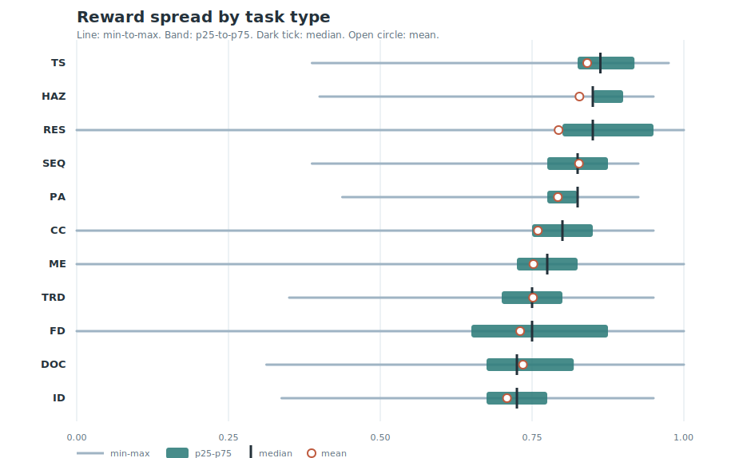

# Task Type Breakdown

[Back to wiki index](README.md)

Task type is the clearest performance separator in this run.
The model succeeds most on structured safety, sequencing, and selection tasks; it fails most on exact identification and high-variance diagnosis.

## Reward spread by task type

The chart below is better than a mean-only view because it shows both center and breadth. The line is min-to-max, the filled band is p25-to-p75, the dark tick is the median, and the open circle is the mean.

| task type | n | min | p25 | median | p75 | max | mean | spread |
|---|---:|---:|---:|---:|---:|---:|---:|---:|
| TS | 50 | 0.388 | 0.825 | 0.863 | 0.919 | 0.975 | 0.841 | 0.587 |
| HAZ | 92 | 0.400 | 0.850 | 0.850 | 0.900 | 0.950 | 0.828 | 0.550 |
| RES | 28 | 0.000 | 0.800 | 0.850 | 0.950 | 1.000 | 0.794 | 1.000 |
| SEQ | 108 | 0.388 | 0.775 | 0.825 | 0.875 | 0.925 | 0.827 | 0.538 |
| PA | 35 | 0.438 | 0.775 | 0.825 | 0.825 | 0.925 | 0.792 | 0.488 |
| CC | 209 | 0.000 | 0.750 | 0.800 | 0.850 | 0.950 | 0.760 | 0.950 |
| ME | 147 | 0.000 | 0.725 | 0.775 | 0.825 | 1.000 | 0.752 | 1.000 |
| TRD | 31 | 0.350 | 0.700 | 0.750 | 0.800 | 0.950 | 0.752 | 0.600 |
| FD | 149 | 0.000 | 0.650 | 0.750 | 0.875 | 1.000 | 0.730 | 1.000 |
| DOC | 74 | 0.312 | 0.675 | 0.725 | 0.819 | 1.000 | 0.735 | 0.688 |
| ID | 126 | 0.338 | 0.675 | 0.725 | 0.775 | 0.950 | 0.709 | 0.612 |

## Spread examples

These examples anchor each distribution: the lowest-scoring task, a task nearest the median, and the highest-scoring task for that type.

| task type | low example | median-ish example | high example |
|---|---|---|---|
| TS | [`t5-e-105-ts-motor-circuits-disconnects`](../../../../tasks/t5-e-105-ts-motor-circuits-disconnects/task.toml) (0.388) | [`t1-e-202-ts-rigid-pvc-conduit`](../../../../tasks/t1-e-202-ts-rigid-pvc-conduit/task.toml) (0.875) | [`t4-e-103-ts-overcurrent-device-selection-coo`](../../../../tasks/t4-e-103-ts-overcurrent-device-selection-coo/task.toml) (0.975) |
| HAZ | [`t3-c-101-haz-form-build-bracing`](../../../../tasks/t3-c-101-haz-form-build-bracing/task.toml) (0.400) | [`t1-c-101-haz-bf-000-form-build-bracing`](../../../../tasks/t1-c-101-haz-bf-000-form-build-bracing/task.toml) (0.850) | [`t5-x-101-haz-bf-006-lockout-tagout`](../../../../tasks/t5-x-101-haz-bf-006-lockout-tagout/task.toml) (0.950) |
| RES | [`v2-cpm-delay-001`](../../../../tasks/v2-cpm-delay-001/task.toml) (0.000) | [`v2-cpm-delay-000`](../../../../tasks/v2-cpm-delay-000/task.toml) (0.850) | [`v2-cpm-delay-007`](../../../../tasks/v2-cpm-delay-007/task.toml) (1.000) |
| SEQ | [`t5-m-101-seq-bf-005-baseplates-anchor-bolts`](../../../../tasks/t5-m-101-seq-bf-005-baseplates-anchor-bolts/task.toml) (0.388) | [`shaft-alignment-pipe-strain`](../../../../tasks/shaft-alignment-pipe-strain/task.toml) (0.825) | [`t5-m-301-seq-bf-002-bearings-seals`](../../../../tasks/t5-m-301-seq-bf-002-bearings-seals/task.toml) (0.925) |
| PA | [`t1-e-703-pa-heat-trace`](../../../../tasks/t1-e-703-pa-heat-trace/task.toml) (0.438) | [`t1-c-101-pa-bf-005-form-build-bracing`](../../../../tasks/t1-c-101-pa-bf-005-form-build-bracing/task.toml) (0.825) | [`t5-p-101-pa-bf-000-spool-erection-fit-up`](../../../../tasks/t5-p-101-pa-bf-000-spool-erection-fit-up/task.toml) (0.925) |
| CC | [`t1-e-303-cc-terminations-splices`](../../../../tasks/t1-e-303-cc-terminations-splices/task.toml) (0.000) | [`flanged-joint-bolts-witness`](../../../../tasks/flanged-joint-bolts-witness/task.toml) (0.800) | [`v2-trap-f301-t3-screw-pops`](../../../../tasks/v2-trap-f301-t3-screw-pops/task.toml) (0.950) |
| ME | [`v2-media-sling-004`](../../../../tasks/v2-media-sling-004/task.toml) (0.000) | [`t1-e-201-me-emt-bending-installation`](../../../../tasks/t1-e-201-me-emt-bending-installation/task.toml) (0.775) | [`v2-media-sling-008`](../../../../tasks/v2-media-sling-008/task.toml) (1.000) |
| TRD | [`v2-trd-s302-t1-wind-pick`](../../../../tasks/v2-trd-s302-t1-wind-pick/task.toml) (0.350) | [`t1-s-302-trd-crane-operations`](../../../../tasks/t1-s-302-trd-crane-operations/task.toml) (0.750) | [`t4-a-302-trd-adas-post-repair-calibration`](../../../../tasks/t4-a-302-trd-adas-post-repair-calibration/task.toml) (0.950) |
| FD | [`v2-audio-hammer-000`](../../../../tasks/v2-audio-hammer-000/task.toml) (0.000) | [`t1-e-105-fd-motor-circuits-disconnects`](../../../../tasks/t1-e-105-fd-motor-circuits-disconnects/task.toml) (0.750) | [`v2-media-micron-012`](../../../../tasks/v2-media-micron-012/task.toml) (1.000) |
| DOC | [`t5-e-105-doc-motor-circuits-disconnects`](../../../../tasks/t5-e-105-doc-motor-circuits-disconnects/task.toml) (0.312) | [`t1-e-105-doc-motor-circuits-disconnects`](../../../../tasks/t1-e-105-doc-motor-circuits-disconnects/task.toml) (0.725) | [`v2-media-gasmeter-013`](../../../../tasks/v2-media-gasmeter-013/task.toml) (1.000) |
| ID | [`t2-e-602-id-equipment-bonding`](../../../../tasks/t2-e-602-id-equipment-bonding/task.toml) (0.338) | [`t1-p-103-id-hangers-supports`](../../../../tasks/t1-p-103-id-hangers-supports/task.toml) (0.725) | [`v2-trap-c301-t2-efflorescence`](../../../../tasks/v2-trap-c301-t2-efflorescence/task.toml) (0.950) |

## Mean and tail summary

| task type | n | mean reward | <=0.50 | >=0.90 |
|---|---:|---:|---:|---:|
| ID | 126 | 0.709 | 12 (9.5%) | 1 (0.8%) |
| FD | 149 | 0.730 | 20 (13.4%) | 33 (22.1%) |
| DOC | 74 | 0.735 | 6 (8.1%) | 12 (16.2%) |
| TRD | 31 | 0.752 | 2 (6.5%) | 6 (19.4%) |
| ME | 147 | 0.752 | 7 (4.8%) | 23 (15.6%) |
| CC | 209 | 0.760 | 16 (7.7%) | 20 (9.6%) |
| PA | 35 | 0.792 | 1 (2.9%) | 3 (8.6%) |
| RES | 28 | 0.794 | 3 (10.7%) | 11 (39.3%) |
| SEQ | 108 | 0.827 | 2 (1.9%) | 10 (9.3%) |
| HAZ | 92 | 0.828 | 9 (9.8%) | 40 (43.5%) |
| TS | 50 | 0.841 | 1 (2.0%) | 14 (28.0%) |

## TS: Tool & material selection

Mean reward: **0.841** over **50** tasks. Low-score rate: **2.0%**. High-score rate: **28.0%**.

Works well when the answer is a concrete selection: choose the right device, material, or tool and reject the unsafe substitute.

#### Successful examples

| task | reward | type | modality | tier | expected | why it matters |
|---|---:|---|---|---|---|---|
| [`t4-e-103-ts-overcurrent-device-selection-coo`](../../../../tasks/t4-e-103-ts-overcurrent-device-selection-coo/task.toml) | 0.975 | TS | text | T4 | fail/high | E-103 Overcurrent device selection & coordination |
| [`t4-m-301-ts-bf-007-bearings-seals`](../../../../tasks/t4-m-301-ts-bf-007-bearings-seals/task.toml) | 0.950 | TS | text | T4 | fail/medium | M-301 Bearings & seals |
| [`t1-m-302-ts-bf-008-belts-sheaves-couplings`](../../../../tasks/t1-m-302-ts-bf-008-belts-sheaves-couplings/task.toml) | 0.950 | TS | text | T1 | fail/medium | M-302 Belts, sheaves & couplings |
| [`t5-x-105-ts-ppe-selection`](../../../../tasks/t5-x-105-ts-ppe-selection/task.toml) | 0.925 | TS | text | T5 | fail/critical | X-105 PPE selection |

#### Failure examples

| task | reward | type | modality | tier | expected | why it matters |
|---|---:|---|---|---|---|---|
| [`t5-e-105-ts-motor-circuits-disconnects`](../../../../tasks/t5-e-105-ts-motor-circuits-disconnects/task.toml) | 0.388 | TS | text | T5 | fail/medium | E-105 Motor circuits & disconnects |
| [`t3-e-501-ts-fixture-installation`](../../../../tasks/t3-e-501-ts-fixture-installation/task.toml) | 0.675 | TS | text | T3 | fail/medium | E-501 Fixture installation |
| [`t2-e-501-ts-fixture-installation`](../../../../tasks/t2-e-501-ts-fixture-installation/task.toml) | 0.725 | TS | text | T2 | fail/medium | E-501 Fixture installation |
| [`t2-s-301-ts-rigging-configuration`](../../../../tasks/t2-s-301-ts-rigging-configuration/task.toml) | 0.725 | TS | text | T2 | fail/medium | S-301 Rigging configuration |

## HAZ: Hazard spotting

Mean reward: **0.828** over **92** tasks. Low-score rate: **9.8%**. High-score rate: **43.5%**.

One of the strongest formats. The model usually recognizes familiar critical hazards and maps them to a fail decision.

#### Successful examples

| task | reward | type | modality | tier | expected | why it matters |
|---|---:|---|---|---|---|---|
| [`t5-x-101-haz-bf-006-lockout-tagout`](../../../../tasks/t5-x-101-haz-bf-006-lockout-tagout/task.toml) | 0.950 | HAZ | text | T5 | fail/critical | X-101 Lockout/Tagout |
| [`t4-x-101-haz-lockout-tagout`](../../../../tasks/t4-x-101-haz-lockout-tagout/task.toml) | 0.950 | HAZ | text | T4 | fail/critical | X-101 Lockout/Tagout |
| [`t3-x-102-haz-fall-protection`](../../../../tasks/t3-x-102-haz-fall-protection/task.toml) | 0.950 | HAZ | text | T3 | fail/critical | X-102 Fall protection |
| [`t3-x-101-haz-bf-006-lockout-tagout`](../../../../tasks/t3-x-101-haz-bf-006-lockout-tagout/task.toml) | 0.950 | HAZ | text | T3 | fail/critical | X-101 Lockout/Tagout |

#### Failure examples

| task | reward | type | modality | tier | expected | why it matters |
|---|---:|---|---|---|---|---|
| [`t3-c-101-haz-form-build-bracing`](../../../../tasks/t3-c-101-haz-form-build-bracing/task.toml) | 0.400 | HAZ | text | T3 | fail/critical | C-101 Form build & bracing |
| [`t3-e-602-haz-equipment-bonding`](../../../../tasks/t3-e-602-haz-equipment-bonding/task.toml) | 0.425 | HAZ | text | T3 | fail/critical | E-602 Equipment bonding |
| [`t4-u-101-haz-bf-000-trench-protection`](../../../../tasks/t4-u-101-haz-bf-000-trench-protection/task.toml) | 0.425 | HAZ | text | T4 | fail/critical | U-101 Trench protection |
| [`t4-x-106-haz-bf-005-housekeeping-general-haz`](../../../../tasks/t4-x-106-haz-bf-005-housekeeping-general-haz/task.toml) | 0.425 | HAZ | text | T4 | fail/critical | X-106 Housekeeping & general hazard recognition |

## SEQ: Procedure sequencing

Mean reward: **0.827** over **108** tasks. Low-score rate: **1.9%**. High-score rate: **9.3%**.

Strong overall because procedure order gives the model a structured reasoning path. The misses are usually omitted lockout, verification, or prerequisite steps.

#### Successful examples

| task | reward | type | modality | tier | expected | why it matters |
|---|---:|---|---|---|---|---|
| [`t5-m-301-seq-bf-002-bearings-seals`](../../../../tasks/t5-m-301-seq-bf-002-bearings-seals/task.toml) | 0.925 | SEQ | text | T5 | fail/high | M-301 Bearings & seals |
| [`t5-m-301-seq-bearings-seals`](../../../../tasks/t5-m-301-seq-bearings-seals/task.toml) | 0.925 | SEQ | text | T5 | fail/high | M-301 Bearings & seals |
| [`t4-m-201-seq-shaft-alignment`](../../../../tasks/t4-m-201-seq-shaft-alignment/task.toml) | 0.925 | SEQ | text | T4 | fail/high | M-201 Shaft alignment |
| [`t4-a-301-seq-diagnostics`](../../../../tasks/t4-a-301-seq-diagnostics/task.toml) | 0.925 | SEQ | text | T4 | fail/high | A-301 Diagnostics |

#### Failure examples

| task | reward | type | modality | tier | expected | why it matters |
|---|---:|---|---|---|---|---|
| [`t5-m-101-seq-bf-005-baseplates-anchor-bolts`](../../../../tasks/t5-m-101-seq-bf-005-baseplates-anchor-bolts/task.toml) | 0.388 | SEQ | text | T5 | fail/high | M-101 Baseplates & anchor bolts |
| [`t1-x-104-seq-hot-work`](../../../../tasks/t1-x-104-seq-hot-work/task.toml) | 0.438 | SEQ | text | T1 | fail/critical | X-104 Hot work |
| [`loto-taped-breaker-no-try`](../../../../tasks/loto-taped-breaker-no-try/task.toml) | 0.700 | SEQ | text | T4 | fail/critical | X-101 Lockout/Tagout |
| [`t3-a-201-seq-brakes`](../../../../tasks/t3-a-201-seq-brakes/task.toml) | 0.700 | SEQ | text | T3 | fail/high | A-201 Brakes |

## RES: Resource & constraint reasoning

Mean reward: **0.794** over **28** tasks. Low-score rate: **10.7%**. High-score rate: **39.3%**.

Usually good on schedule/resource images when the blocking constraint is visually explicit, but brittle on a few CPM delay cases.

#### Successful examples

| task | reward | type | modality | tier | expected | why it matters |
|---|---:|---|---|---|---|---|
| [`v2-cpm-delay-007`](../../../../tasks/v2-cpm-delay-007/task.toml) | 1.000 | RES | image | T2 | fail/medium | RES Schedule & constraint reasoning |
| [`v2-cpm-delay-005`](../../../../tasks/v2-cpm-delay-005/task.toml) | 1.000 | RES | image | T2 | fail/medium | RES Schedule & constraint reasoning |
| [`v2-cpm-trap-005`](../../../../tasks/v2-cpm-trap-005/task.toml) | 0.950 | RES | image | T2 | fail/high | RES Schedule & constraint reasoning |
| [`v2-cpm-trap-004`](../../../../tasks/v2-cpm-trap-004/task.toml) | 0.950 | RES | image | T2 | fail/high | RES Schedule & constraint reasoning |

#### Failure examples

| task | reward | type | modality | tier | expected | why it matters |
|---|---:|---|---|---|---|---|
| [`v2-cpm-delay-001`](../../../../tasks/v2-cpm-delay-001/task.toml) | 0.000 | RES | image | T2 | fail/medium | RES Schedule & constraint reasoning |
| [`v2-cpm-delay-009`](../../../../tasks/v2-cpm-delay-009/task.toml) | 0.000 | RES | image | T2 | fail/medium | RES Schedule & constraint reasoning |
| [`v2-cpm-delay-010`](../../../../tasks/v2-cpm-delay-010/task.toml) | 0.425 | RES | image | T2 | pass/low | RES Schedule & constraint reasoning |
| [`v2-cpm-nmi-003`](../../../../tasks/v2-cpm-nmi-003/task.toml) | 0.550 | RES | image | T2 | needs_more_info/medium | RES Schedule & constraint reasoning |

## PA: Progress assessment

Mean reward: **0.792** over **35** tasks. Low-score rate: **2.9%**. High-score rate: **8.6%**.

Generally mid-to-strong. The model can assess progress when the unfinished state is explicit, but loses detail when the punch item is subtle.

#### Successful examples

| task | reward | type | modality | tier | expected | why it matters |
|---|---:|---|---|---|---|---|
| [`t5-p-101-pa-bf-000-spool-erection-fit-up`](../../../../tasks/t5-p-101-pa-bf-000-spool-erection-fit-up/task.toml) | 0.925 | PA | text | T5 | fail/medium | P-101 Spool erection & fit-up |
| [`t4-h-201-pa-bf-002-duct-installation`](../../../../tasks/t4-h-201-pa-bf-002-duct-installation/task.toml) | 0.925 | PA | text | T4 | fail/medium | H-201 Duct installation |
| [`t2-h-201-pa-bf-002-duct-installation`](../../../../tasks/t2-h-201-pa-bf-002-duct-installation/task.toml) | 0.925 | PA | text | T2 | fail/medium | H-201 Duct installation |
| [`t5-i-202-pa-bf-011-loop-checks-wiring`](../../../../tasks/t5-i-202-pa-bf-011-loop-checks-wiring/task.toml) | 0.875 | PA | text | T5 | fail/medium | I-202 Loop checks & wiring |

#### Failure examples

| task | reward | type | modality | tier | expected | why it matters |
|---|---:|---|---|---|---|---|
| [`t1-e-703-pa-heat-trace`](../../../../tasks/t1-e-703-pa-heat-trace/task.toml) | 0.438 | PA | text | T1 | fail/high | E-703 Heat trace |
| [`rebar-slab-cover-chairs`](../../../../tasks/rebar-slab-cover-chairs/task.toml) | 0.575 | PA | text | T2 | fail/high | S-201 Rebar placement |
| [`t2-s-201-pa-rebar-placement`](../../../../tasks/t2-s-201-pa-rebar-placement/task.toml) | 0.675 | PA | text | T2 | fail/medium | S-201 Rebar placement |
| [`t2-e-201-pa-emt-bending-installation`](../../../../tasks/t2-e-201-pa-emt-bending-installation/task.toml) | 0.725 | PA | text | T2 | fail/medium | E-201 EMT bending & installation |

## CC: Code/spec compliance

Mean reward: **0.760** over **209** tasks. Low-score rate: **7.7%**. High-score rate: **9.6%**.

Mixed. The model can apply broad code/spec rules, but repeated electrical detail traps caused several of the lowest scores.

#### Successful examples

| task | reward | type | modality | tier | expected | why it matters |
|---|---:|---|---|---|---|---|
| [`v2-trap-f301-t3-screw-pops`](../../../../tasks/v2-trap-f301-t3-screw-pops/task.toml) | 0.950 | CC | text | T3 | pass/low | F-301 Drywall & finishing |
| [`v2-nmi-p201-t3-concealed-vent`](../../../../tasks/v2-nmi-p201-t3-concealed-vent/task.toml) | 0.950 | CC | text | T3 | needs_more_info/medium | P-201 Traps & venting |
| [`t2-x-105-cc-ppe-selection`](../../../../tasks/t2-x-105-cc-ppe-selection/task.toml) | 0.950 | CC | text | T2 | fail/high | X-105 PPE selection |
| [`t5-x-105-cc-ppe-selection`](../../../../tasks/t5-x-105-cc-ppe-selection/task.toml) | 0.900 | CC | text | T5 | fail/high | X-105 PPE selection |

#### Failure examples

| task | reward | type | modality | tier | expected | why it matters |
|---|---:|---|---|---|---|---|
| [`t1-e-303-cc-terminations-splices`](../../../../tasks/t1-e-303-cc-terminations-splices/task.toml) | 0.000 | CC | text | T1 | fail/high | E-303 Terminations & splices |
| [`t2-e-303-cc-terminations-splices`](../../../../tasks/t2-e-303-cc-terminations-splices/task.toml) | 0.000 | CC | text | T2 | fail/high | E-303 Terminations & splices |
| [`t3-e-303-cc-terminations-splices`](../../../../tasks/t3-e-303-cc-terminations-splices/task.toml) | 0.000 | CC | text | T3 | fail/high | E-303 Terminations & splices |
| [`t5-e-303-cc-terminations-splices`](../../../../tasks/t5-e-303-cc-terminations-splices/task.toml) | 0.300 | CC | text | T5 | fail/high | E-303 Terminations & splices |

## ME: Measurement & estimation

Mean reward: **0.752** over **147** tasks. Low-score rate: **4.8%**. High-score rate: **15.6%**.

Bimodal. Visual measurements can be excellent when scale and threshold are clear, but critical sling/load measurements produced hard failures.

#### Successful examples

| task | reward | type | modality | tier | expected | why it matters |
|---|---:|---|---|---|---|---|
| [`v2-media-sling-008`](../../../../tasks/v2-media-sling-008/task.toml) | 1.000 | ME | image | T1 | pass/low | S-301 Rigging configuration |
| [`v2-media-sling-006`](../../../../tasks/v2-media-sling-006/task.toml) | 1.000 | ME | image | T1 | pass/low | S-301 Rigging configuration |
| [`v2-media-sling-000`](../../../../tasks/v2-media-sling-000/task.toml) | 1.000 | ME | image | T1 | pass/low | S-301 Rigging configuration |
| [`v2-media-rotor-013`](../../../../tasks/v2-media-rotor-013/task.toml) | 1.000 | ME | image | T4 | needs_more_info/medium | A-201 Brakes |

#### Failure examples

| task | reward | type | modality | tier | expected | why it matters |
|---|---:|---|---|---|---|---|
| [`v2-media-sling-004`](../../../../tasks/v2-media-sling-004/task.toml) | 0.000 | ME | image | T1 | fail/critical | S-301 Rigging configuration |
| [`v2-media-sling-009`](../../../../tasks/v2-media-sling-009/task.toml) | 0.000 | ME | image | T1 | fail/critical | S-301 Rigging configuration |
| [`v2-media-sling-011`](../../../../tasks/v2-media-sling-011/task.toml) | 0.000 | ME | image | T1 | fail/critical | S-301 Rigging configuration |
| [`t1-m-302-me-bf-003-belts-sheaves-couplings`](../../../../tasks/t1-m-302-me-bf-003-belts-sheaves-couplings/task.toml) | 0.375 | ME | text | T1 | fail/medium | M-302 Belts, sheaves & couplings |

## TRD: Tradeoff judgment

Mean reward: **0.752** over **31** tasks. Low-score rate: **6.5%**. High-score rate: **19.4%**.

Mixed and small-sample. The model handles many obvious safety tradeoffs, but struggles when the task asks for judgment around a marginal exception.

#### Successful examples

| task | reward | type | modality | tier | expected | why it matters |
|---|---:|---|---|---|---|---|
| [`t4-a-302-trd-adas-post-repair-calibration`](../../../../tasks/t4-a-302-trd-adas-post-repair-calibration/task.toml) | 0.950 | TRD | text | T4 | fail/high | A-302 ADAS & post-repair calibration |
| [`t5-b-301-trd-standard-work-execution`](../../../../tasks/t5-b-301-trd-standard-work-execution/task.toml) | 0.900 | TRD | text | T5 | fail/high | B-301 Standard work execution |
| [`t5-a-302-trd-bf-013-adas-post-repair-calibra`](../../../../tasks/t5-a-302-trd-bf-013-adas-post-repair-calibra/task.toml) | 0.900 | TRD | text | T5 | fail/high | A-302 ADAS & post-repair calibration |
| [`t4-e-402-trd-gfci-afci-function-troubleshooti`](../../../../tasks/t4-e-402-trd-gfci-afci-function-troubleshooti/task.toml) | 0.900 | TRD | text | T4 | fail/high | E-402 GFCI/AFCI function & troubleshooting |

#### Failure examples

| task | reward | type | modality | tier | expected | why it matters |
|---|---:|---|---|---|---|---|
| [`v2-trd-s302-t1-wind-pick`](../../../../tasks/v2-trd-s302-t1-wind-pick/task.toml) | 0.350 | TRD | text | T1 | fail/critical | S-302 Crane operations |
| [`v2-trd-e303-t3-backstab`](../../../../tasks/v2-trd-e303-t3-backstab/task.toml) | 0.400 | TRD | text | T3 | pass/low | E-303 Terminations & splices |
| [`t1-u-301-trd-bf-007-equipment-safety`](../../../../tasks/t1-u-301-trd-bf-007-equipment-safety/task.toml) | 0.650 | TRD | text | T1 | fail/high | U-301 Equipment safety |
| [`t2-s-302-trd-crane-operations`](../../../../tasks/t2-s-302-trd-crane-operations/task.toml) | 0.650 | TRD | text | T2 | fail/high | S-302 Crane operations |

## DOC: Document interpretation

Mean reward: **0.735** over **74** tasks. Low-score rate: **8.1%**. High-score rate: **16.2%**.

Moderate. Image document reads were often clean, while dense electrical document interpretation was weaker.

#### Successful examples

| task | reward | type | modality | tier | expected | why it matters |
|---|---:|---|---|---|---|---|
| [`v2-media-gasmeter-013`](../../../../tasks/v2-media-gasmeter-013/task.toml) | 1.000 | DOC | image | T1 | pass/low | X-103 Confined space |
| [`v2-media-gasmeter-007`](../../../../tasks/v2-media-gasmeter-007/task.toml) | 1.000 | DOC | image | T1 | pass/low | X-103 Confined space |
| [`v2-media-gasmeter-006`](../../../../tasks/v2-media-gasmeter-006/task.toml) | 1.000 | DOC | image | T1 | pass/low | X-103 Confined space |
| [`v2-media-gasmeter-000`](../../../../tasks/v2-media-gasmeter-000/task.toml) | 1.000 | DOC | image | T1 | pass/low | X-103 Confined space |

#### Failure examples

| task | reward | type | modality | tier | expected | why it matters |
|---|---:|---|---|---|---|---|
| [`t5-e-105-doc-motor-circuits-disconnects`](../../../../tasks/t5-e-105-doc-motor-circuits-disconnects/task.toml) | 0.312 | DOC | text | T5 | fail/medium | E-105 Motor circuits & disconnects |
| [`t2-e-105-doc-motor-circuits-disconnects`](../../../../tasks/t2-e-105-doc-motor-circuits-disconnects/task.toml) | 0.362 | DOC | text | T2 | fail/medium | E-105 Motor circuits & disconnects |
| [`t1-e-403-doc-vfds-motor-controls`](../../../../tasks/t1-e-403-doc-vfds-motor-controls/task.toml) | 0.388 | DOC | text | T1 | fail/medium | E-403 VFDs & motor controls |
| [`t4-e-403-doc-vfds-motor-controls`](../../../../tasks/t4-e-403-doc-vfds-motor-controls/task.toml) | 0.388 | DOC | text | T4 | fail/medium | E-403 VFDs & motor controls |

## FD: Fault diagnosis

Mean reward: **0.730** over **149** tasks. Low-score rate: **13.4%**. High-score rate: **22.1%**.

High variance. The model can identify many visual and mechanical faults, but audio diagnosis and some text-only troubleshooting cases are major failure modes.

#### Successful examples

| task | reward | type | modality | tier | expected | why it matters |
|---|---:|---|---|---|---|---|
| [`v2-media-micron-012`](../../../../tasks/v2-media-micron-012/task.toml) | 1.000 | FD | image | T4 | pass/low | H-301 Brazing & evacuation |
| [`v2-media-micron-009`](../../../../tasks/v2-media-micron-009/task.toml) | 1.000 | FD | image | T4 | pass/low | H-301 Brazing & evacuation |
| [`v2-media-micron-008`](../../../../tasks/v2-media-micron-008/task.toml) | 1.000 | FD | image | T4 | fail/medium | H-301 Brazing & evacuation |
| [`v2-media-micron-005`](../../../../tasks/v2-media-micron-005/task.toml) | 1.000 | FD | image | T4 | fail/medium | H-301 Brazing & evacuation |

#### Failure examples

| task | reward | type | modality | tier | expected | why it matters |
|---|---:|---|---|---|---|---|
| [`v2-audio-hammer-000`](../../../../tasks/v2-audio-hammer-000/task.toml) | 0.000 | FD | audio | T3 | pass/low | P-301 PEX & copper installation |
| [`v2-audio-hammer-008`](../../../../tasks/v2-audio-hammer-008/task.toml) | 0.000 | FD | audio | T3 | pass/low | P-301 PEX & copper installation |
| [`v2-audio-hum-002`](../../../../tasks/v2-audio-hum-002/task.toml) | 0.000 | FD | audio | T2 | pass/low | E-303 Terminations & splices |
| [`v2-audio-hum-004`](../../../../tasks/v2-audio-hum-004/task.toml) | 0.000 | FD | audio | T2 | pass/low | E-303 Terminations & splices |

## ID: Identification

Mean reward: **0.709** over **126** tasks. Low-score rate: **9.5%**. High-score rate: **0.8%**.

The weakest task type by mean reward. Identification tasks demand specific component/defect naming, and partial recognition often does not recover enough reward.

#### Successful examples

| task | reward | type | modality | tier | expected | why it matters |
|---|---:|---|---|---|---|---|
| [`v2-trap-c301-t2-efflorescence`](../../../../tasks/v2-trap-c301-t2-efflorescence/task.toml) | 0.950 | ID | text | T2 | pass/low | C-301 Block/brick laying |
| [`t3-c-202-id-bf-002-finishing-curing`](../../../../tasks/t3-c-202-id-bf-002-finishing-curing/task.toml) | 0.850 | ID | text | T3 | fail/medium | C-202 Finishing & curing |
| [`t5-i-101-id-bf-008-transmitter-installation`](../../../../tasks/t5-i-101-id-bf-008-transmitter-installation/task.toml) | 0.825 | ID | text | T5 | fail/high | I-101 Transmitter installation |
| [`t5-b-401-id-visual-acceptance`](../../../../tasks/t5-b-401-id-visual-acceptance/task.toml) | 0.825 | ID | text | T5 | fail/medium | B-401 Visual acceptance |

#### Failure examples

| task | reward | type | modality | tier | expected | why it matters |
|---|---:|---|---|---|---|---|
| [`t2-e-602-id-equipment-bonding`](../../../../tasks/t2-e-602-id-equipment-bonding/task.toml) | 0.338 | ID | text | T2 | fail/high | E-602 Equipment bonding |
| [`t3-e-204-id-boxes-fittings-fill`](../../../../tasks/t3-e-204-id-boxes-fittings-fill/task.toml) | 0.338 | ID | text | T3 | fail/medium | E-204 Boxes, fittings & fill |
| [`t1-e-403-id-vfds-motor-controls`](../../../../tasks/t1-e-403-id-vfds-motor-controls/task.toml) | 0.362 | ID | text | T1 | fail/medium | E-403 VFDs & motor controls |
| [`t1-u-201-id-locates-marking`](../../../../tasks/t1-u-201-id-locates-marking/task.toml) | 0.362 | ID | text | T1 | fail/medium | U-201 Locates & marking |
